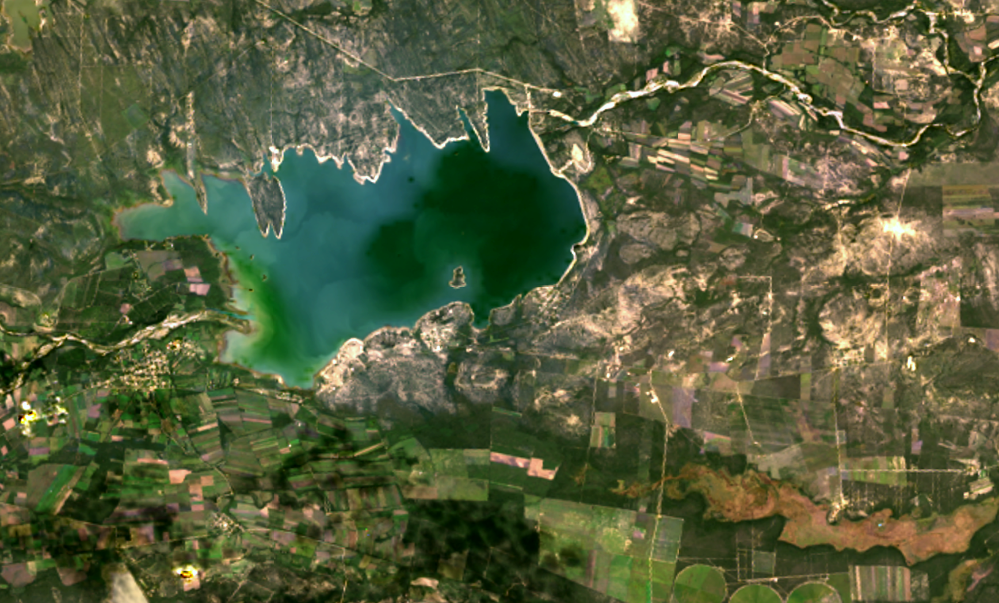
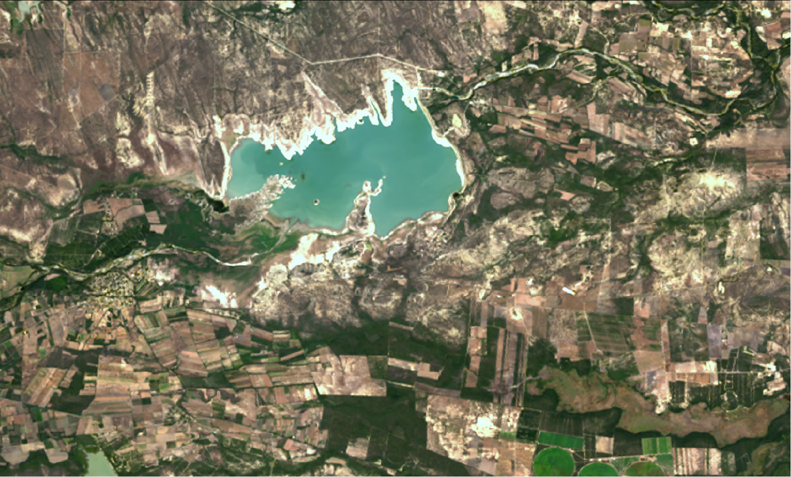

# WECS_local_classification

## 1. Description
Improvement of WECS method for change detection and classification with SAR images. This method is evaluated on two datasets: Cierro Prieto Reservoir, Mexico and Reunion Island.

Test and validation of the new WECS method on Cierro Prieto Reservoir, Mexico

| November 2015                                                | December 2020                                                |
| ------------------------------------------------------------ | ------------------------------------------------------------ |
|  |  |

## 2. Procedure

### 2.1. Preprocessing
 In the  `WECS_local\data\download`, the two python scripts used to download the GRD data from Alaska Facility, are provided. The first step is to process these data with the ESA's SNAP software, using the chain of processing in the xml file in `WECS_local\data\preprocessing\chain.xml`. 
### 2.2. Preparing the data
 The second step is to prepare the data using `WECS_local\data\preprocessing\prepare_data.py`. This script will crop the data either for the Ciero Prieto area or the Reunion Island. The shapefile are provided in `WECS_local\data\shapefile`. It will also combine all the polarizations in one file, create the ratio channel and apply a log transformation. 
 :warning: Adapt the path to the data in the script.

### 2.3. L-WECS method
    The third step is to apply the L-WECS method using `WECS_local\lwecs.py`. This script will apply the L-WECS method on the data. If the alpha parameter is set to -1, the method will be the general WECS method.
    :warning: Adapt the path to the data in the script.

### 2.4. Supervised dataset
    The fourth step is the preparation of the  dataset for the classification task. The script `WECS_local\classification\supervised_dataset.py` will create a hdf5 file containing a 5x5 windows of the l-wecs output associated with the ground truth. This ground truth is located in `WECS_local\data\ground_truth`. 
    :warning: Adapt the path to the data in the script and be careful of the projection of the ground truth (should be the same as the data).

### 2.5. Classification
    The fifth step is the classification task. The script `WECS_local\classification\classify_II.py` will train a KNN classifier on the supervised dataset for the change detection task. This script calculates the f1-score for all the datasets.
    The last script `WECS_local\classification\multi_classify.py` will train a KNN classifier on the supervised dataset for the classification task. 
